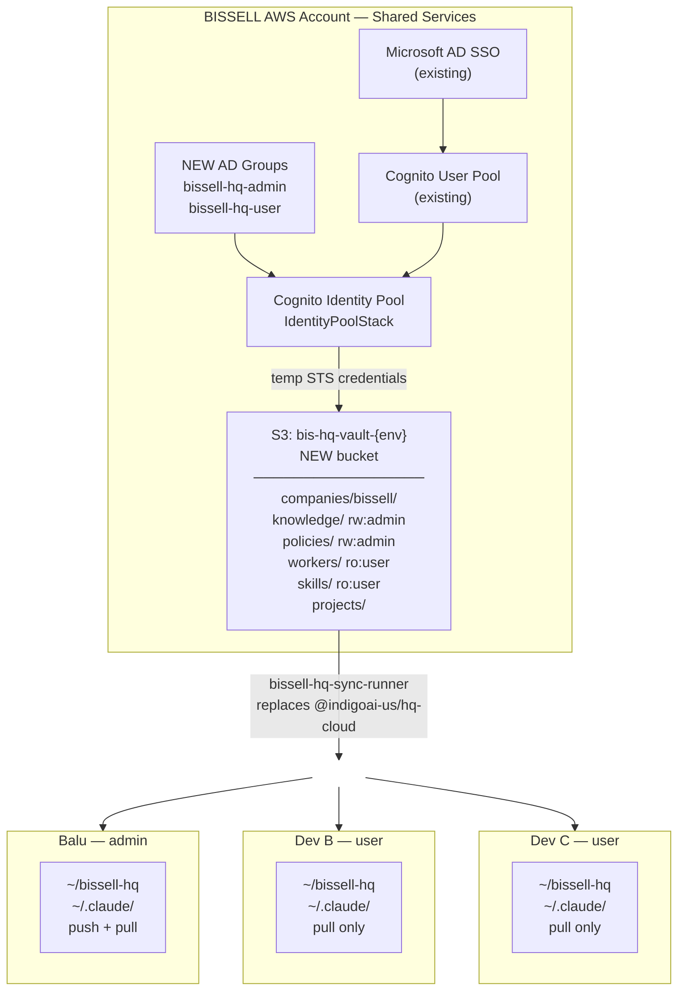
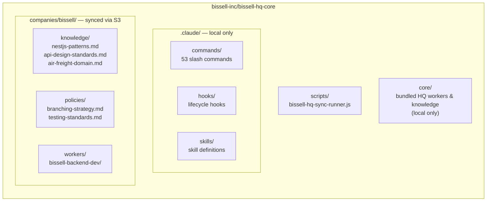
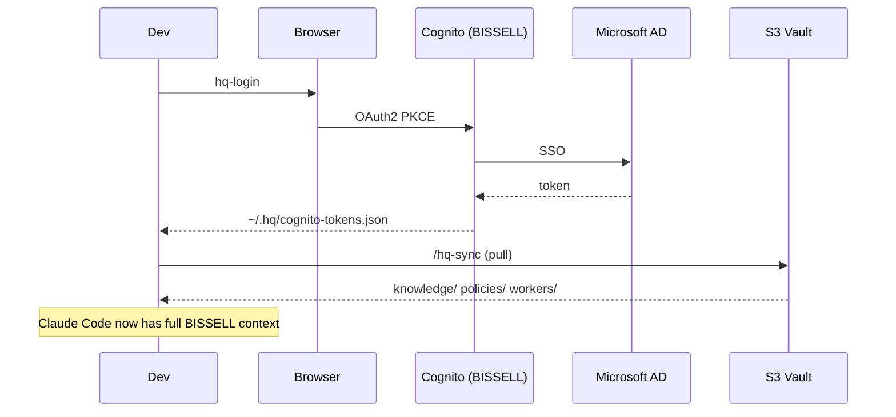
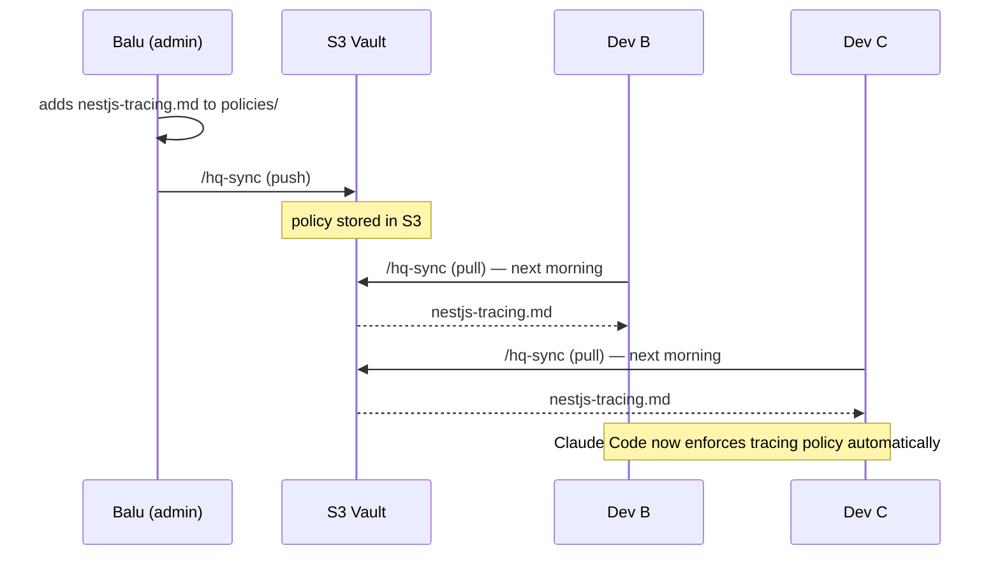

# BISSELL HQ Architecture

Self-hosted version of Indigo HQ using BISSELL's existing AWS infrastructure.

---

## Architecture Overview



---

## AD Group → IAM Role Mapping

| AD Group | IAM Role | S3 Access | Who |
|----------|----------|-----------|-----|
| `bissell-hq-admin` | `adminRole` | read + write all `companies/bissell/*` | Balu, tech leads |
| `bissell-hq-user` | `userRole` | read only `companies/bissell/*` | All other devs |

Admins curate knowledge/policies → push to S3 → all users pull automatically.

---

## Repo Structure (`bissell-inc/bissell-hq-core`)



---

## What Syncs vs. What Stays Local

| Location | Synced to S3 | Description |
|----------|-------------|-------------|
| `companies/bissell/knowledge/` | ✅ Yes | BISSELL docs, domain knowledge |
| `companies/bissell/policies/` | ✅ Yes | Coding standards, governance rules |
| `companies/bissell/workers/` | ✅ Yes | Custom BISSELL AI agents |
| `companies/bissell/skills/` | ✅ Yes | Custom BISSELL skills |
| `companies/bissell/projects/` | ✅ Yes | PRDs, project state |
| `.claude/commands/` | ❌ No | HQ engine — updated via `git pull` |
| `.claude/hooks/` | ❌ No | Lifecycle hooks — local only |
| `core/workers/` | ❌ No | Bundled HQ workers — local only |
| `workspace/threads/` | ❌ No | Personal session state |
| `personal/` | ❌ No | Personal notes |

---

## CDK Changes Required (`feature/bissell-api-mcp`)

**`infrastructure/shared-cdk/config/dev-1/cdk.config.ts`** — update config:
```typescript
identityPoolName: 'bis-hq',
adminGroup: 'bissell-hq-admin',   // new AD group
userGroup: 'bissell-hq-user',     // new AD group
s3BucketName: 'bis-hq-vault',     // new dedicated bucket
```

Same pattern for `uat` and `prod` configs.

The `IdentityPoolStack` CDK code already supports these as config properties — no structural changes needed.

---

## Developer Daily Workflow

### First-time setup (once per machine)
```bash
git clone https://github.com/bissell-inc/bissell-hq-core ~/bissell-hq
cp -r ~/bissell-hq/.claude/* ~/.claude/
```

### Start of day
```bash
hq-login   # browser opens → Microsoft AD login → closes
/hq-sync   # pulls latest company knowledge from S3
```



### Working in any repo
```bash
cd ~/code/bissell/bissell-air-freight-service
claude     # open Claude Code — full BISSELL context available

/run backend-dev implement-feature
/quality-gate
/prd "add carrier quote comparison"
/review
```

### When you add/update knowledge or policies
```bash
# Edit files in ~/bissell-hq/companies/bissell/knowledge/ or policies/
/hq-sync   # pushes changes to S3
# All other devs get it on their next /hq-sync
```



---

## Enterprise AI Governance

| Concern | How It's Handled |
|---------|-----------------|
| Consistent coding standards | `policies/` files injected into every Claude Code session |
| Change control on standards | PRs to `bissell-inc/bissell-hq-core` — reviewed like any code change |
| Audit trail | Git history on the fork — every policy change is a commit |
| Access control | AD groups → Cognito → IAM roles → S3 prefix permissions |
| New hire onboarding | Clone repo, copy `.claude/`, run `/hq-sync` — full BISSELL context on day 1 |
| Secrets | Never in knowledge base — stays in AWS Secrets Manager |
| Data residency | All data stays in BISSELL's own AWS account — nothing goes to Indigo |

---

## Implementation Tasks

| Task | Depends On | Effort |
|------|-----------|--------|
| Create AD groups (`bissell-hq-admin`, `bissell-hq-user`) in Azure AD | Dan/IT | ~1 hr |
| Update CDK config with new AD groups + bucket name | AD groups created | ~2 hrs |
| Merge `feature/bissell-api-mcp` and deploy to dev-1 | CDK config updated | ~2 hrs |
| Write `bissell-hq-sync-runner.js` | S3 bucket deployed | ~1-2 days |
| Fork hq-core → `bissell-inc/bissell-hq-core`, patch sync + login commands | Sync runner done | ~2 hrs |
| Populate initial BISSELL knowledge base | Fork ready | ~4-8 hrs |
| End-to-end test with 2-3 devs | All above done | ~4 hrs |

**Total: ~3-4 days of engineering work.**

---

## Key Decision: Self-Hosted vs. Indigo Commercial

| | Self-Hosted (this doc) | Indigo Commercial |
|--|----------------------|-------------------|
| Data residency | BISSELL AWS account only | Indigo's AWS account |
| Auth | BISSELL Cognito + AD | Indigo's Cognito pool |
| Cost | AWS S3 + infra (~$10-20/mo) | Per-seat SaaS pricing (unknown) |
| Control | Full — you own everything | Vendor dependency |
| Maintenance | You maintain sync runner | Indigo maintains |
| Enterprise security | BISSELL's existing controls | Indigo's (unverified) |
